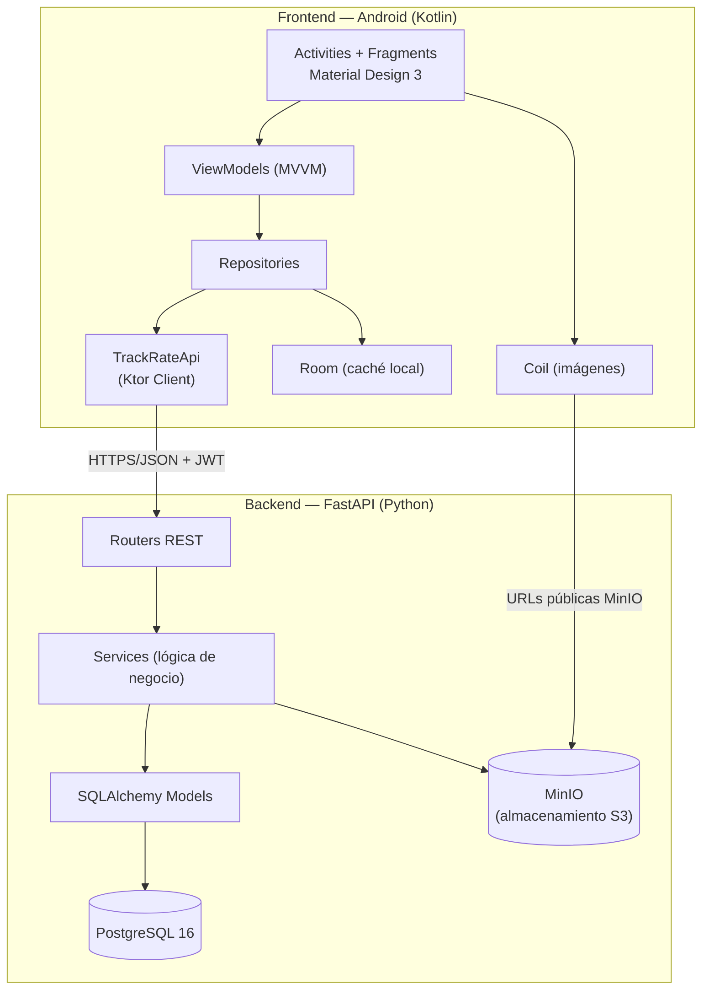

# TrackRate — Material de presentación

**Curso:** 1GS132 — Ingeniería de Desarrollo de Software Móvil  
**Proyecto final:** TrackRate — red social de valoración musical (estilo Letterboxd para música)

**Integrantes del equipo:**

| # | Nombre | Cédula |
|---|--------|--------|
| 1 | Leonardo Castro | 8-1032-1264 |
| 2 | Jorge Sarmiento | 3-757-1758 |
| 3 | Mariam Harris | 1-756-2331 |

---

## 1. Descripción del proyecto

TrackRate es una aplicación móvil Android con backend propio que permite:

- **Explorar** un catálogo musical (artistas, álbumes, canciones) aprobado por moderación.
- **Valorar** obras con estrellas (0.5–5.0) y escribir reseñas.
- **Seguir** a otros usuarios y ver su actividad en un feed social.
- **Crear listas** personalizadas y compartir portadas.
- **Enviar** nuevas entradas al catálogo (flujo de moderación).
- **Gestionar** el perfil (avatar, datos, contraseña) y preferencias de la app.

La arquitectura separa claramente **cliente Android (frontend móvil)** y **API REST (backend)**, comunicados por HTTP + JSON con autenticación JWT.

---

## 2. Arquitectura general



### Flujo de una petición típica

1. El usuario interactúa con un **Fragment** (p. ej. Home).
2. El **ViewModel** solicita datos al **Repository**.
3. El Repository llama a **TrackRateApi** (Ktor), que adjunta el token JWT si existe.
4. FastAPI valida el token, ejecuta la lógica en **services** y consulta **PostgreSQL**.
5. La respuesta JSON se mapea a modelos de dominio y la UI se actualiza vía **StateFlow**.

---

## 3. Frontend — Aplicación Android

### 3.1 Lenguaje y plataforma

| Aspecto | Detalle |
|---------|---------|
| Lenguaje | **Kotlin** |
| SDK mínimo | Android 10 (API 29) |
| SDK objetivo | Android 36 |
| IDE | Android Studio |
| Build | Gradle 9 + AGP 9.2 |

### 3.2 Patrón arquitectónico: MVVM

La app sigue **Model-View-ViewModel** con capas bien definidas:

| Capa | Ubicación | Responsabilidad |
|------|-----------|-----------------|
| **UI** | `ui/*` (Fragments, Activities, Adapters) | Mostrar datos, capturar eventos del usuario |
| **ViewModel** | `ui/*/ *ViewModel.kt` | Estado de pantalla, lógica de presentación, corrutinas |
| **Repository** | `data/repository/` | Fuente única de datos; combina API y caché local |
| **Remote** | `data/remote/` | Cliente HTTP, DTOs, mapeo JSON ↔ dominio |
| **Local** | `data/local/` | Room (caché), DataStore (preferencias) |
| **Domain** | `domain/model/` | Modelos de negocio independientes del framework |

### 3.3 Tecnologías y bibliotecas Android

| Tecnología | Versión (aprox.) | Uso en TrackRate |
|------------|------------------|------------------|
| **AndroidX AppCompat** | 1.7 | Compatibilidad y temas base |
| **Material Components** | 1.12 | UI Material Design 3 (toolbar, botones, campos, chips) |
| **Navigation Component** | 2.8 | Navegación entre fragments dentro de `MainActivity` |
| **Lifecycle + ViewModel** | 2.8 | Ciclo de vida y estado sobreviviente a rotaciones |
| **View Binding** | — | Acceso type-safe a vistas XML (sin `findViewById`) |
| **Kotlin Coroutines + Flow** | 1.9 | Operaciones asíncronas y streams reactivos (`StateFlow`) |
| **Dagger Hilt** | 2.59 | Inyección de dependencias (`@HiltViewModel`, `@Inject`) |
| **Ktor Client** | 3.1 | Cliente HTTP hacia la API REST |
| **Kotlinx Serialization** | 1.7 | Serialización/deserialización JSON |
| **Coil** | 2.7 | Carga y caché de imágenes (avatares, portadas) |
| **Room** | 2.7 | Base de datos SQLite local para caché offline |
| **RecyclerView** | 1.3 | Listas eficientes (feed, diario, búsqueda, listas) |

### 3.4 Estructura de navegación

La app reduce el número de Activities y concentra la navegación principal en **fragments**:

#### Activities (4)

| Activity | Rol |
|----------|-----|
| `LoginActivity` | Autenticación (login / registro) |
| `MainActivity` | Contenedor principal con bottom nav y NavHost |
| `DetailActivity` | Detalle de artista, álbum o canción |
| `SubmitActivity` | Formulario para enviar entradas al catálogo |

#### Fragments principales (dentro de `MainActivity`)

| Fragment | Función |
|----------|---------|
| `HomeFragment` | Feed social + top valoradas |
| `SearchFragment` | Búsqueda en catálogo |
| `DiaryFragment` | Diario personal de valoraciones |
| `SettingsFragment` | Tema, tamaño de texto, color de acento |
| `ProfileFragment` | Perfil público de un usuario |
| `EditProfileFragment` | Editar perfil y avatar |
| `ChangePasswordFragment` | Cambio de contraseña |
| `ListsFragment` / `ListDetailFragment` | Listas musicales |
| `SubmissionsFragment` | Mis envíos al catálogo |
| `ModerationOptionsFragment` | Panel admin (moderación, usuarios, sellos) |
| `ModerationFragment` / `ModerationReviewFragment` | Cola y revisión de envíos |
| `AdminUsersFragment` | Promover/degradar administradores |
| `LabelsFragment` | Gestión de sellos discográficos |

### 3.5 Funcionalidades destacadas del cliente

- **Autenticación JWT:** token almacenado de forma segura; cierre de sesión automático ante respuestas 401.
- **Subida de imágenes:** galería y cámara (`FileProvider` + permisos) para avatares, portadas y envíos.
- **Zoom de imágenes:** diálogo fullscreen con gestos de pellizco.
- **Personalización:** modo oscuro, tamaño de texto y color de acento (púrpura, azul, rojo).
- **Manejo de errores:** pantallas de error con reintento en Home, Search y Diary.
- **Adaptabilidad:** layouts alternativos para pantallas anchas (`layout-w600dp`).

### 3.6 Estructura de carpetas — Android (`app/`)

```
app/src/main/
├── java/com/example/trackrate/
│   ├── LoginActivity.kt, MainActivity.kt, DetailActivity.kt, SubmitActivity.kt
│   ├── TrackRateApplication.kt          # @HiltAndroidApp
│   ├── di/                              # Módulos Hilt (App, Network, Database)
│   ├── data/
│   │   ├── remote/                      # TrackRateApi, DTOs, UnauthorizedSessionHandler
│   │   ├── repository/                  # Auth, Catalog, Feed, Rating, List, …
│   │   └── local/                       # Room entities/DAOs, UserPreferencesStore
│   ├── domain/model/                    # UserProfile, Catalog, Rating, …
│   ├── ui/
│   │   ├── auth/                        # AuthViewModel, ChangePasswordFragment
│   │   ├── home/                        # HomeFragment, FeedAdapter
│   │   ├── search/                      # SearchFragment
│   │   ├── diary/                       # DiaryFragment
│   │   ├── profile/                     # Profile, EditProfile
│   │   ├── lists/                       # Lists, ListDetail
│   │   ├── moderation/                  # Submissions, Moderation, Review
│   │   ├── admin/                       # AdminUsersFragment
│   │   ├── labels/                      # LabelsFragment
│   │   ├── settings/                    # SettingsFragment
│   │   ├── detail/                      # ViewModels/adapters para DetailActivity
│   │   ├── submit/                      # SubmitViewModel
│   │   └── image/                       # ImageZoomDialogFragment, ZoomImageView
│   └── util/                            # Navigation, ApiErrorMapper, CameraCapture, …
├── res/
│   ├── layout/                          # XML de pantallas e ítems
│   ├── navigation/mobile_navigation.xml # Grafo de navegación
│   ├── menu/                            # Bottom nav, overflow
│   ├── drawable/                        # Iconos MDI, logos
│   └── values/                          # strings, colors, themes
└── AndroidManifest.xml
```

---

## 4. Backend — API REST

### 4.1 Lenguaje y runtime

| Aspecto | Detalle |
|---------|---------|
| Lenguaje | **Python 3.12+** |
| Framework web | **FastAPI** |
| Servidor ASGI | **Uvicorn** |
| Contenedor | **Docker** + Docker Compose |

### 4.2 Patrón arquitectónico

El backend sigue una arquitectura en capas típica de APIs REST:

| Capa | Ubicación | Responsabilidad |
|------|-----------|-----------------|
| **Routers** | `app/routers/` | Endpoints HTTP, validación de entrada, códigos de respuesta |
| **Services** | `app/services/` | Lógica de negocio (auth, catálogo, ratings, feed, uploads) |
| **Models** | `app/models/` | Entidades SQLAlchemy (tablas PostgreSQL) |
| **Schemas** | `app/schemas/` | Modelos Pydantic (request/response JSON) |
| **Deps** | `app/deps/` | Dependencias FastAPI (usuario autenticado, permisos admin) |
| **Core** | `app/core/` | JWT, hashing bcrypt, política de contraseñas |

### 4.3 Tecnologías y bibliotecas backend

| Tecnología | Uso en TrackRate |
|------------|------------------|
| **FastAPI** | API REST con documentación OpenAPI automática (`/docs`) |
| **Uvicorn** | Servidor ASGI de alto rendimiento |
| **SQLAlchemy 2** | ORM para PostgreSQL |
| **Alembic** | Migraciones versionadas de base de datos |
| **PostgreSQL 16** | Base de datos relacional principal |
| **Pydantic v2** | Validación de datos y configuración (`pydantic-settings`) |
| **python-jose** | Creación y verificación de tokens JWT |
| **bcrypt** | Hash seguro de contraseñas |
| **MinIO** | Almacenamiento de objetos compatible S3 (imágenes) |
| **psycopg 3** | Driver PostgreSQL para Python |
| **Docker Compose** | Orquestación de Postgres + MinIO + API |

### 4.4 Infraestructura (Docker Compose)

| Servicio | Puerto | Función |
|----------|--------|---------|
| `postgres` | 5432 | Base de datos relacional |
| `minio` | 9000 / 9001 | Almacenamiento de imágenes (API / consola web) |
| `api` | 8000 | API FastAPI (migraciones + seed + Uvicorn) |

**Buckets MinIO:** `avatars`, `catalog-covers`, `artist-images`, `list-covers`

### 4.5 Módulos funcionales de la API

| Módulo | Router | Descripción |
|--------|--------|-------------|
| Auth | `/auth/*` | Registro, login, JWT, cambio de contraseña |
| Perfiles | `/profiles/*`, `/me/profile` | Perfiles públicos y edición propia |
| Catálogo | `/catalog/*` | Búsqueda, detalle, envíos de artistas/álbumes/tracks |
| Moderación | `/admin/moderation/*` | Cola pending, aprobar/rechazar (solo admin) |
| Valoraciones | `/me/ratings`, `/me/diary` | CRUD de ratings y diario |
| Social | `/feed`, `/me/following/*` | Feed de actividad y seguimiento |
| Listas | `/me/lists/*`, `/lists/*` | CRUD de listas e ítems |
| Uploads | `/me/avatar`, `/catalog/.../cover`, … | Subida de imágenes a MinIO |
| Sellos | `/labels/*` | Gestión de record labels |
| Usuarios | `/admin/users/*`, `/users/*/stats` | Admin y estadísticas |

### 4.6 Estructura de carpetas — Backend (`backend/`)

```
backend/
├── app/
│   ├── main.py                 # Punto de entrada FastAPI, CORS, routers
│   ├── config.py               # Settings (Pydantic)
│   ├── core/
│   │   ├── security.py         # JWT, bcrypt
│   │   └── password_policy.py  # Reglas de contraseña
│   ├── db/
│   │   ├── session.py          # Sesión SQLAlchemy
│   │   └── base.py
│   ├── deps/
│   │   └── auth.py             # get_current_user, require_admin
│   ├── models/
│   │   └── entities.py         # Tablas ORM
│   ├── schemas/                # Pydantic request/response
│   ├── routers/                # Endpoints por dominio
│   └── services/               # Lógica de negocio
├── alembic/
│   └── versions/               # Migraciones SQL versionadas
├── scripts/
│   └── seed.py                 # Datos de desarrollo (admin, catálogo demo)
├── docker-compose.yml
├── Dockerfile
├── requirements.txt
└── .env.example
```

---

## 5. Estructura general del repositorio

```
TrackRate/
├── app/                        # Cliente Android (Kotlin)
├── backend/                    # API FastAPI + Docker
├── docs/
│   ├── PRESENTACION.md         # Este documento
│   ├── LICENSES.md             # Licencias y atribución (checklist)
│   ├── ASSETS.md               # Logos e iconografía
│   ├── icons.md                # Convención iconos MDI
│   └── legacy-supabase/        # Esquema Supabase archivado (referencia histórica)
├── logo_icon.svg               # Fuente diseño — icono
├── logo_full.svg               # Fuente diseño — logotipo
├── gradle/libs.versions.toml   # Catálogo de versiones Android
├── local.properties.example    # Plantilla config Android (API_BASE_URL)
└── README.md                   # Inicio rápido del proyecto
```

---

## 6. Comunicación cliente ↔ servidor

| Aspecto | Implementación |
|---------|----------------|
| Protocolo | HTTP/REST |
| Formato | JSON |
| Autenticación | Bearer JWT en header `Authorization` |
| Cliente HTTP | Ktor Client (Android) |
| Documentación API | Swagger UI en `http://localhost:8000/docs` |
| Config Android | `API_BASE_URL` en `local.properties` |
| Emulador → PC | `http://10.0.2.2:8000` (API) y `:9000` (MinIO) |

---

## 7. Seguridad

- Contraseñas hasheadas con **bcrypt** en el servidor.
- Política de contraseñas validada en cliente y servidor.
- Endpoints de administración protegidos con rol `is_admin`.
- Tokens JWT con expiración; la app cierra sesión ante respuestas 401.
- Imágenes en buckets MinIO con URLs públicas de solo lectura.

---

## 8. Demo rápida para la presentación

### Arrancar el backend

```powershell
cd backend
copy .env.example .env
docker compose up --build
```

- API: http://localhost:8000/docs  
- MinIO: http://localhost:9001 (`minioadmin` / `minioadmin`)

### Credenciales de desarrollo

| Campo | Valor |
|-------|--------|
| Email | `admin@trackrate.dev` |
| Password | `TrackRateAdmin123!` |
| Username | `admin` |

### Arrancar Android

1. Copiar `local.properties.example` → `local.properties`
2. Configurar `API_BASE_URL=http://10.0.2.2:8000`
3. Run en emulador desde Android Studio

### Flujos recomendados para mostrar en vivo

1. **Login** con cuenta admin → Home con feed y top valoradas.
2. **Buscar** un artista/álbum → abrir **detalle** → valorar con estrellas.
3. **Diario** → ver historial de valoraciones propias.
4. **Perfil** → editar avatar (galería/cámara) → cambiar contraseña.
5. **Enviar al catálogo** (SubmitActivity) → ver en **Mis envíos**.
6. **Moderación** (menú admin) → aprobar/rechazar un envío pendiente.
7. **Listas** → crear lista, añadir ítems, subir portada.

---

## 9. Evolución del proyecto

TrackRate comenzó con un esquema **Supabase** (Auth + PostgREST) documentado en `docs/legacy-supabase/`. El backend actual es una **migración completa a FastAPI + PostgreSQL + MinIO**, lo que da control total sobre la lógica de negocio, moderación y almacenamiento de archivos.

En Android, la refactorización reciente consolidó múltiples Activities en **Fragments con Navigation Component**, reduciendo la app a **4 Activities** y mejorando la experiencia de navegación.

---

## 10. Referencias adicionales

| Documento | Contenido |
|-----------|-----------|
| [`README.md`](../README.md) | Inicio rápido |
| [`backend/README.md`](../backend/README.md) | Endpoints detallados de la API |
| [`docs/LICENSES.md`](LICENSES.md) | Licencias de dependencias y recursos |
| [`docs/ASSETS.md`](ASSETS.md) | Logos e iconografía propia |
